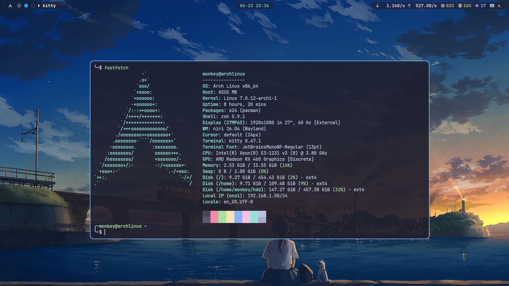

# nifi-config

中科大源：  
Server = https://mirrors.ustc.edu.cn/archlinux/$repo/os/$arch  
cn源：  
[archlinuxcn]  
Server = https://mirrors.ustc.edu.cn/archlinuxcn/$arch  

kitty intel-ucode vulkan-radeon firefox waypaper pipewire-pulse pavucontrol swayidle awww swaylock-effects libnotify mako polkit-gnome xwayland-satellite  

输入法  
fcitx5-im  fcitx5-chinese-addons  
字体  
ttf-dejavu ttf-jetbrains-mono-nerd noto-fonts-cjk noto-fonts-emoji (noto-fonts adobe-source-han-sans-otc-fonts)  
    -- aur：ttf-harmonyos-sans  
    --      ttf-roboto-mono-nerd
截图软件  
grim swappy slurp  

查看字体家族  
fc-list : family | sort -u  
刷新字体缓存  
fc-cache -fv  

清理孤包  
sudo pacman -Rns $(pacman -Qdtq)  

查看僵尸进程  
ps -eo pid,ppid,stat,cmd | awk '$3 ~ /^Z/ {print}'  

重启网卡  
nmcli device disconnect eno1  
nmcli device connect eno1 

echo "127.0.1.1        archlinux.localdomain   archlinux" >> /etc/hosts

ALL:sudo pacman -S vulkan-radeon pipewire-pulse pavucontrol swayidle awww swaylock-effects libnotify mako polkit-gnome xwayland-satellite ttf-dejavu ttf-jetbrains-mono-nerd noto-fonts-cjk noto-fonts-emoji fcitx5-im fcitx5-chinese-addons fcitx5-mozc waybar  

查看有哪些shell  
    cat /etc/shells  

查看正在使用的shell  
    echo $SHEL  

切换shell  
    chsh -s /bin/zsh

    
